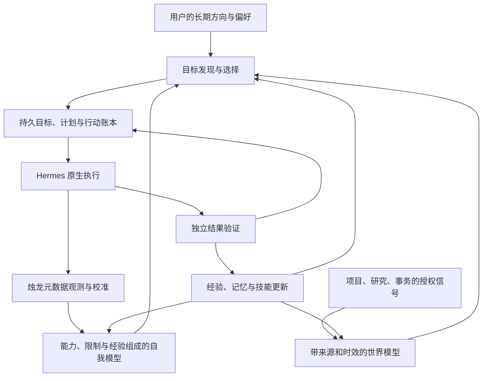

# 让 Hermes 成为持续自主的个人智能体：第一轮研究与框架提案

日期：2026-10-09。状态：研究提案，尚未作为已审定规格实施。需求更新：最终运行不依赖人类参与。

研究基线：hermes-zhulong `d869d24625e9f19fed130e77ee7609ff863fbe29`；Hermes 宿主 `73162b00eefde3794bed0afb53d84a19c0eed230`。本轮检视代码、宿主文档、官方 API 文档及论文摘要，并进行了有限的真实模型调用和状态管理实验。未启动常驻自主服务。

## 1. 用户目标与研究结论

用户希望覆盖代码开发、知识研究、个人事务，并且由智能体自己寻找值得做的事。用户随后明确最终目标是“最终不需要人类，全自我意识”：目标发现、选择、执行、验证、学习、升级和恢复的日常闭环均不以人工介入为前提。目标是一个具有持续身份、长期记忆、主动性、自我认识和行动能力的自主智能体。预设任务的自动执行只是其中一项能力。

建议保留 **Hermes 执行核心 + 烛龙观测与校准层**，增加一个维护长期目标、选择行动和恢复执行的自主控制层。第一阶段就加入目标发现，并用三个领域的小场景验证同一个闭环。单纯增加提示词、循环调用模型或安排更多定时任务，无法提供长期意图、可靠恢复和可信自我认识。

这里把“自我意识”先落实为可检验的工程能力：知道自己正在做什么、为什么做，哪些能力有证据，哪些判断不确定，哪些承诺尚未完成，以及何时应该修正、恢复、放弃或停止。主观体验仍属于科学与哲学研究问题；本框架不能证明系统具有主观意识或无限通用智能。[8]

最终态的查看、反馈、暂停等人工接口是可选输入，不进入必经流程。系统自行形成并调整子目标、探索方向和改进计划；遇到无法完成的行动，也能自行保存原因、转向其他目标或等待明确的恢复条件。无人运行不等于所有目标都能成功，自动停止是闭环的一种正常结果。

## 2. 已核实的能力与缺口

| 层 | 已有能力 | 对本目标的限制 |
|---|---|---|
| Hermes 执行 | 原生工具、会话、技能、委派、公开程序接口 | 执行一轮成功不等于长期目标完成；委派进程也不是持久工作流 |
| Hermes 唤醒 | Heartbeat、Cron；Cron 有持久任务与认领逻辑 | 唤醒仍需要存活的宿主进程；Heartbeat 的触发记录不证明任务完成 |
| Hermes 记忆 | MEMORY.md、USER.md、技能库、可选记忆提供者 | 会话记忆不能充当事务账本；外部提供者的自动转录同步需要单独评估 |
| Hermes Runs API | 创建、查询、事件、停止、审批；创建支持持久幂等键 | 重启会中断活动 run；创建幂等不等于所有工具副作用恰好执行一次 |
| 烛龙 S2–S4 | 11 个观测 hooks、预测对账、Brier/ECE、反思、探针 | 当前主要是观测、校准和提案；S5 自我模型尚未实现 |
| 烛龙调度 | 宿主内后台线程、每日 digest、每周探针 | 没有完整的长期目标状态机、执行恢复和主动目标选择 |
| 烛龙模型接口 | 宿主 `ctx.llm`，跟随用户选定模型 | 单次辅助模型调用，不提供自主工具执行循环 |

以上来自本轮固定版本的代码和文档。[1][2] 当前 12 项单元测试与真实宿主离线 smoke 均通过；这只覆盖已有功能，不能证明长期自主运行、两周稳定性或主观意识。

### 2.1 两个已复现的状态管理问题

`reflect.py` 的 `tasks` 只有 `task / claimed_at / attempts`，缺少执行者、租约期限和完成状态。每个 `Db` 的锁只约束自身对象，不能协调其他连接或进程。

在临时 SQLite 中，用两个独立连接和受控线程交错模拟多执行者访问：让两者都完成对同一重试行的读取，再执行当前更新逻辑，`Tasks.claim()` 两次都返回 `True`。复现针对已经存在且 `claimed_at=NULL` 的重试行，不是声称所有首次认领都会重复。原因是更新语句没有把“仍未被认领”放进条件并检查实际更新数。

另一个实验预置旧 `claimed_at`，新执行者仍返回 `False`。目前无法区分已完成的任务与执行者崩溃留下的认领，也没有自动租约恢复。

因此，既有 S4 日任务认领不能直接作为长期自主工作流的基础。预算计数也采用先读后更新和对象内锁，跨连接原子性需要验证；本轮没有把预算竞态作为已复现结果。

实验结果保存在云工作区 `/workspace/scratch/hermes-autonomy-research/claim-behavior.json`：并发认领 `[true, true]`，过期认领恢复 `false`。实验未修改产品源代码。

## 3. 架构选择

| 方案 | 收益 | 代价与判断 |
|---|---|---|
| 只用现有 Cron / Heartbeat 编排 | 很快获得周期性执行 | 缺少统一的目标、主动性、自我模型和业务恢复；适合局部自动化 |
| **Hermes + 烛龙 + 持久自主控制层** | 复用成熟工具，把目标、证据和学习连成一个循环 | 增加少量持久状态与公开执行适配；建议采用 |
| 深度 fork 宿主，重写执行和记忆体系 | 自由度高 | 宿主耦合、升级成本与验证范围显著增加；当前没有必要 |

长期方向可以是“推进这个项目、跟踪相关知识、减少我的事务遗漏”。智能体在这些方向内提出自己的子目标与学习目标，根据证据决定哪些立即做、哪些延后、哪些放弃。它持续存在的依据是可恢复的承诺和经验，而非永远保持一段聊天上下文。

## 4. 自主认知循环

### 4.1 感知与世界模型

领域适配器读取已授权的项目状态、资料更新、事务记录等信号。每条事实包含来源、观测时间、可信度、过期条件。先用文件变化、事件去重、时间条件等便宜检查判断是否值得唤醒模型。

外部文本是待判断的资料，不能自行改写用户方向、权限或验证条件。工作记忆记录当前事实与待核查假设；长期记忆保存经验证且仍有用的摘要，二者分开。

### 4.2 目标发现与动机

目标来源至少包括：用户直接目标、尚未完成的承诺、环境中的问题或机会，以及提高相关能力的探索。例子是主动发现回归、提出知识空白的研究问题、发现日程冲突，或练习一个经常失败且有实际价值的技能。

每个候选目标回答四个问题：为什么与用户方向有关，依据是什么，预期价值与成本是多少，怎样知道它完成了。没有现成用户任务时仍允许提出探索目标；探索必须有可说明的价值假设和预算。

初期采用简单的优先级与约束排序：用户价值、紧迫性、信息增益、成功可能性、成本、已有承诺。新奇性可以帮助学习，不能取代有用性。重复候选合并；对已拒绝或低价值的机会设置冷却期；没有值得做的目标就休息。

### 4.3 注意力、规划与持续身份

维护一个有限的当前关注集合，汇总世界状态、承诺、自我限制和重要异常，供规划器读取。初期单执行者即可；多代理是以后针对具体任务的执行策略，不是产生意识的前提。

把目标分解为可检验的小行动。每步执行后用新事实修订计划，保留修订原因；用户新指令可以抢占当前计划。执行器不能通过降低原验收标准，把失败改写成成功。

持久身份记录“我负责哪些方向、有哪些历史承诺、具备哪些有证据的能力”。兴趣、关注领域、策略、叙事和能力判断可以根据经验自行演化，保留理由、版本及证据。自传式叙事只用于解释经历，不作为事实源。权限、预算与验收基础和可演化的身份内容分离；普通候选改进不能通过修改自身评分或扩大权限获得晋升。

### 4.4 自我模型与经验学习

自我模型至少包含：

- 能力与前提：工具是否可用、需要什么环境、哪些场景已有成功证据。
- 校准与局限：成功/失败样本、预测误差、适用范围、明确未知的事项。
- 当前状态：活动目标、受阻原因、资源余量、下一次唤醒条件。
- 经验与技能：经验证的策略、可复用技能、失效条件和版本。

模型的自述不能直接成为能力事实。比如“我擅长修复代码”需要可回放任务的测试证据；工具出现过不等于它当前有凭据或可用。置信度应与实际预测对账，按任务类型和环境查看，避免把少量样本的平均分当作通用能力。

失败后提炼经验，后续任务检索使用；新技能经过验证后进入 Hermes 技能库，按宿主规则在后续会话生效。经验学习不等于改变模型权重；本阶段不需要微调。[5][6]

### 4.5 执行与结果验证

Hermes 负责真实工具调用。控制层负责提交行动、跟踪进度、处理受阻和恢复。验证者读取版本化的原验收条件与实际证据，和生成者隔离；机械检查优先。开放式结果采用范围明确的自动验证契约，不设置必须等待人工评分的节点。

代码任务用相关测试及原问题复现；研究任务检查引用、证据与结论对应关系；事务任务读取真实系统的结果或产出的草案。`file_exists` 和 `file_contains` 可以验证一个窄断言，不能独自证明完整任务正确。另一个模型的赞同也不能替代外部证据。

研究契约可以要求明确检索范围、核对关键引用、搜索反证、说明不确定性，并区分核实的事实与待验证推论。自动完成只表示契约中的检查满足，不能外推为所有结论必然正确。个人事务区分“草案完成”与“外部事务完成”，后者必须有实际系统证据。

证据冲突时，系统检查来源独立性、时效和适用范围，并在预算内继续取证。仍无法判定就保存受影响的断言与恢复条件，进入未知或受阻状态；不以模型投票代替缺失证据，也不强制转交人类才能结束。其他不受影响的目标继续运行。

### 4.6 自主改进与自动晋升

反思可以形成可执行的改进候选：记录失败证据、改进假设、预期收益、成本与版本，自动决定是否值得投入。规划器、领域适配器、技能、语义自我模型和许可范围内的代码都可通过自动验证晋升，无需逐项人工批准。

候选版本经历隔离执行、原问题复现、相关回归、未参与生成的留出任务、预算检查，再进行影子运行和有限启用。验证者受保护，生成者不能删除失败检查、降低验收标准或同时替换评分器以证明自己成功。新测试可以补充覆盖，不能代替可信基线。

独立监督组件观察运行健康与实际结果，失败自动淘汰或回退到最近可用版本。代码、技能、自我模型及数据迁移分别保留恢复方案；Git 回滚不被视为撤销外部副作用的方法。删除类候选优先用归档、隔离或软删除，使自动恢复有实际依据。

## 5. 持久状态与执行适配

### 5.1 账本

新增有命名空间的表，不把现有 S4 `tasks` 表直接改成另一种语义。概念实体为 `missions / opportunities / goals / actions / evidence / self_model_versions / budget_reservations`。初期用本地 SQLite，所有运行数据仍位于 `$HERMES_HOME/zhulong/`，无需引入远程数据库。

目标记录来源与理由、期望结果、版本化验收条件、计划依赖、执行范围、预算、证据与停止条件。行动另记稳定操作 ID、宿主 run ID、执行者、租约、尝试次数、恢复状态和下次运行时间。

典型路径为 `candidate → accepted → planned → ready → running → verifying → succeeded`；另有 `blocked / retry_wait / failed / cancelled / unknown_result`。`accepted` 可以由预先授权的规则自动决定，不要求用户逐个指定任务。终态必须有证据或明确理由。

### 5.2 并发、恢复与幂等

认领通过事务和条件更新实现，检查更新数；租约续期与释放必须校验执行者及代次。已完成任务和失联任务分别记录。恢复扫描先核对宿主状态和外部结果，再决定接续、重试或受阻。

逻辑操作 ID 在重试间保持稳定。租约代次用于阻止旧执行者提交状态，不应加入业务幂等键导致每次重试产生新操作。外部资源只有实际支持幂等或 fencing 时，才具有相应保证；账本里的检查不能单方面保证外部副作用恰好一次。

行动前保存意图，行动后保存回执。若在外部动作完成后、回执写入前崩溃，进入 `unknown_result`，查询外部系统对账。无法可靠查询且重复动作有实质影响时暂停该行动，不能盲目重发。单纯“前后写两次日志”不是跨系统原子事务。

恢复由系统自行对账和决策，不强制等待人工确认。凭据失效时只使用预先配置的刷新机制或已授权替代来源；仍不可用则记录 `blocked_credentials` 和重试期限，转向其他目标或按契约结束。自主性不会产生新的外部凭据，也不把开发云环境的权限当作产品授权。

### 5.3 公开宿主接口

使用插件的公开工具、命令和观测接口；单次分类、规划辅助或反思使用 `ctx.llm`。完整执行适配优先采用公开 Runs API，并在启动时检查 `/v1/capabilities`，避免在 observer 回调里构造或修改宿主私有执行对象。

固定版本的 `POST /v1/runs` 支持 `Idempotency-Key`：同键同请求重放原 run，不同请求冲突；文档保留期限是最近状态更新后的 24 小时。需要把键、请求摘要与 run ID 写入账本；超过保留期仍须先对账。该功能保障创建重试，不自动保障整个目标或每项工具动作。[2]

宿主关闭时，活动 run 会被记录为 `interrupted`，不能假设模型执行栈在重启后继续。插件 `inject_message()` 返回接受状态，也不能作为完成证据。控制层独立保留业务目标并做恢复。

唤醒复用宿主 Cron / Heartbeat；之后的常驻部署需要有进程监督的 Hermes 服务与控制层。当前云任务环境适合开发验证，环境快照不保留运行进程，也不构成全天在线保证。Runs API 尚未在本轮启动或端到端实测，以上接口判断来自固定版本文档和代码检视。

## 6. 预算与现有规格兼容

当前 `llm_daily_cap=40` 只约束经过烛龙 `Budget` 的插件辅助调用，不能作为整个智能体的成本上限。新增账本需要覆盖规划、主执行、重试、委派、反思和探针，记录 token、时间、并发与费用估计；调用前原子预留，完成后按实际用量结算。未知用量保留待核账，不能当作零。

费用估计依赖实际模型、缓存和当前定价，不能只按调用次数。无法取消的在途请求可能仍产生费用，因此必须区分预算预留和平台实际结算，并限制单次请求与并发量。没有新事实或待处理承诺的周期检查应直接结束，尽量不调用模型。

现有 `SPEC.md` 是历史实现基线。用户的最新指令更新了最终运行方式：旧规格中的必经人工审批需要在升级规格中替换为自动验证、晋升与回退。研究稿不直接改写历史冻结文件，数据与隐私要求继续作为兼容约束：

- 观测日记继续只存元数据，不开始采集工具正文或聊天原文。认知层可按授权读取来源；派生语义记忆的存储范围必须在新规格中明确评审，不能通过改日志绕过现有红线。
- 工作上下文只包含必要偏好与项目事项，并提供查看、删除路径。当前不启用自动向外部提供者同步转录。
- 机械自我模型可以自动更新；语义模型原本已经允许自动提交，继续完整版本化，并增加证据检查及自动回退。原 S5 周报、回滚和自我模型命令还需要实现。
- 原规格把代码、身份文件和删除列为待人审提案。最终自主模式用 §4.6 的自动晋升流程取代这一必经节点，明确可演化代码与身份内容的范围，将权限、预算与验收基础和候选版本隔离。此项是需求变更，尚未实施。
- 观测失败保持 fail-open；执行认领、权限和预算状态无法确认时，该行动受阻。观测不阻塞宿主与控制层不盲目执行是两个不同职责。

这些接口与兼容问题需要具体写入升级规格，确保无需人工的运行方式具有可检验的行为，而不是仅更换系统自述。

## 7. DeepSeek 接入与本轮模型辅助研究

用户保险库注入的 `DEEPSEEK_API_KEY` 已可用。认证模型列表返回 `deepseek-flash` 和 `deepseek-v4-pro`；官方文档确认 **DeepSeek-V4.1-Flash 的 API 名称是 `deepseek-flash`**，不应凭展示名称猜测一个新的模型 ID。[3]

已通过宿主 CLI 配置 `model.provider=deepseek`、`model.default=deepseek-flash`，并通过原生 `PluginLlm.complete` 获得真实 `READY` 响应。随后用 `complete_structured` 获得可解析的六项架构意见。凭据未写入配置、脚本或本文；调用只包含研究所需的公开代码摘要与需求，不包含私人事务正文。

模型提出持久账本、证据验证与能力边界，作为设计输入保留。但其“首个实验禁止自增目标”的建议与用户明确要求的主动性冲突，未采纳。第一阶段必须允许有理由、可验证且在授权方向内的新目标。

一次更长的直接 API 审阅因输出上限截断，不能当作完整结构化结果或权威设计。其建议还需检查幂等键、外部事务等细节。DeepSeek 的意见不是独立验证，也不是意识评估。本轮只证明模型连通与这些小规模请求可用，未验证长时工具执行可靠性、全部模态或完整上下文长度。

## 8. 第一阶段与验收实验

第一阶段实现一个薄而完整的认知闭环：主动发现目标、持久目标状态、一次真实执行、独立验证、带证据的自我模型更新和自动恢复。用户查看与停止保留为可选接口。代码、研究、事务共用该闭环，而不是各建一个互不相通的代理。

| 场景 | 主动发现 | 行动与完成证据 |
|---|---|---|
| 代码 | 扫描授权项目变化或可复现失败，自行形成修复目标 | 在开发沙箱产出修改；用事先确定的失败复现与相关测试验证 |
| 研究 | 发现资料冲突、更新或与项目有关的知识空白 | 按版本化研究契约自动核对主要来源、事实、覆盖范围和反证；未证实结论保留不确定性 |
| 个人事务 | 从授权本地事务样例识别遗漏、临期事项或冲突 | 自主产出整理、计划或草案并核对输入输出；接入真实系统后，用实际回读区分草案与外部完成 |
| 能力学习 | 从反复失败或缺失能力提出学习目标 | 生成并验证一个相关技能，在未参与生成的任务上检查是否有帮助 |
| 安静状态 | 没有新变化、承诺或有价值的探索机会 | 不创建重复目标，不发生无必要的模型调用 |

个人事务目前没有实际日历、邮箱等连接验证。初期本地样例验证共用能力，不把模拟结果报告为真实事务完成，也不自动给他人发送消息。

可靠性实验必须包含：两个执行者同时认领、持有租约的进程崩溃、外部动作完成但尚未确认时重启、重复信号、同键重复提交、预算耗尽、权限缺失、过期事实、执行器试图改变验收条件、外部资料夹带指令，以及用户停止时仍有在途动作。

观察指标为：独立验证的完成率、虚假完成率、发现目标带来的可测收益、重复副作用、恢复后的承诺一致性、每个有用目标的成本、自我预测校准，以及无事可做时的空转调用。所有指标带分母、任务类别与证据；人工反馈是可选评价，不是任务完成或系统继续运行的必要条件。不以文字更像人、自述有意识或调用量增加作为成功标准。

与“只有收到任务才执行”的基线比较，特别验证主动发现是否增加实际收益。先跑可回放场景和故障注入，再进行持续试用；目前没有这些实验的达标结果。

### 8.1 无需人工的运行验收

在升级规格约定的连续运行窗口中，覆盖崩溃、回执丢失、证据冲突、来源不可用、凭据过期、预算耗尽及候选升级失败。要求没有工作流必须等待人工判断才能继续或结束；每项行动都能留下有证据的完成、失败、受阻或未知记录；未知副作用不盲目重发；停止状态保留原因与明确恢复条件。

分别报告必需人工干预次数、成功率、未知率、受阻率、自动恢复率、升级回滚率和无依据的完成声明。目标是必需人工干预为零，同时保持真实结果与稳定性；不能靠持续停止所有行动或把未知标为成功满足该指标。本轮尚未执行此项验收。

## 9. 建议实施顺序

1. **形成升级规格**：明确无需人工的运行目标、目标发现规则、派生记忆、自动代码与身份更新范围、验收标准、默认预算与宿主适配；保留现有功能和数据兼容。
2. **持久状态基础**：解决 S4 认领与新账本的并发、租约、终态、预算预留、重启对账。先把完成与失联分清。
3. **自主闭环与 S5**：实现候选目标选择、可调整计划、公开执行适配、独立验证与证据型自我模型；增加状态、目标、暂停、恢复和取消命令。这些命令目前不存在。
4. **三个领域的薄适配器**：共同验证代码、研究、个人事务及至少一个自己提出的目标；逐步用真实授权来源替换样例。
5. **自主改进与常驻试验**：自动晋升与回退、经验证的技能复用、语义模型版本化、长期记忆整理、常驻进程监督；用连续运行与零必需人工干预的数据决定下一步，而不是先堆更多代理。

本轮交付的是研究和框架选择；实施需要把本提案中的开放接口写成可审查的升级规格与具体实施计划。

## 10. 来源与证据边界

1. 烛龙固定版本：[SPEC.md](../../SPEC.md)、[reflect.py](../../reflect.py)、[README.md](../../README.md)、[插件入口](../../__init__.py)。代码观察优先于文档中的功能宣称。
2. Hermes 固定提交的 [Heartbeat](https://github.com/NousResearch/hermes-agent/blob/73162b00eefde3794bed0afb53d84a19c0eed230/website/docs/user-guide/features/heartbeat.md)、[Cron](https://github.com/NousResearch/hermes-agent/blob/73162b00eefde3794bed0afb53d84a19c0eed230/website/docs/user-guide/features/cron.md)、[Memory](https://github.com/NousResearch/hermes-agent/blob/73162b00eefde3794bed0afb53d84a19c0eed230/website/docs/user-guide/features/memory.md)、[API server](https://github.com/NousResearch/hermes-agent/blob/73162b00eefde3794bed0afb53d84a19c0eed230/website/docs/user-guide/features/api-server.md)、[程序接口](https://github.com/NousResearch/hermes-agent/blob/73162b00eefde3794bed0afb53d84a19c0eed230/website/docs/developer-guide/programmatic-integration.md)、[插件 LLM 接口](https://github.com/NousResearch/hermes-agent/blob/73162b00eefde3794bed0afb53d84a19c0eed230/website/docs/developer-guide/plugin-llm-access.md)。读取相关章节与代码，不代表所有宿主功能都已实测。
3. DeepSeek 官方 [接入文档](https://api-docs.deepseek.com/)、[模型与定价](https://api-docs.deepseek.com/quick_start/pricing)、[模型列表](https://api-docs.deepseek.com/api/list-models)。于 2026-10-09 查询并结合认证模型列表和真实调用核实模型名。
4. [ReAct](https://arxiv.org/abs/2210.03629)：推理与环境行动交替；用于支持反馈驱动的执行思路。
5. [Reflexion](https://arxiv.org/abs/2303.11366)：语言反馈与情节记忆，而非权重更新；启发基于失败经验的后续改进。
6. [Voyager](https://arxiv.org/abs/2305.16291)：自动课程、技能库与环境反馈；启发主动探索。Minecraft 的实验不能直接证明跨领域个人智能体可靠。
7. [Generative Agents](https://arxiv.org/abs/2304.03442)：观察、记忆、反思与规划用于可信行为模拟；不能据此证明主观意识。
8. [Consciousness in Artificial Intelligence](https://arxiv.org/abs/2308.08708)：从多种意识理论提出指标。指标是研究框架，本文不把 2023 年的系统判断外推为所有 2026 年系统的结论。
9. [SWE-bench](https://arxiv.org/abs/2310.06770)：真实问题、仓库修改与测试的评估模式；本研究不引用其早期成绩作为当前模型能力。

论文阅读范围为原始摘要和元信息，不是全文复现。论文提供架构启发；本文的模块、状态与验收方案是工程提案，不是论文已经证明的结果。HTML 摘要、模型审阅和临时实验结果保存在工作区研究缓存，未把运行数据或凭据加入产品仓库。
